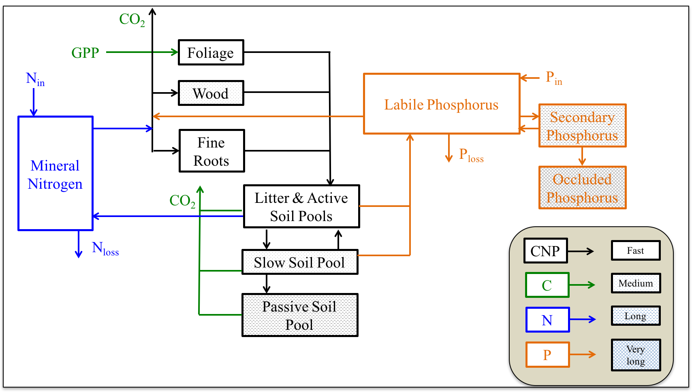

# quasi_equil_analytical

This is a repository for analytically constraining long-term and very-long term ecosystem production at equilibrium. More contents to be added. 

Code structure:
Run Run_prorgams.R to initiate the runs.
Folder Functions includes all quasi-equilibrium analysis related functions, including the analytical solutions, and the post-processing scripts
Folder GDAY includes numerous sub-folders:
1. analyses include all the analyses output
2. code include the simplified GDAY code (in language C)
3. met_data contains driving met data
4. outputs contains all the gday simulation output data
5. params contains the parameter files
6. post_processing contains the R code to post-process the simulations
7. pre_processing contains the R code to pre-process the simulations (e.g. generating met data)
8. simulations contains the gday executive program and the python code to run the simulations

GDAY model framework

Key references:

Quasi-equilibrium analysis:
Comins and McMurtrie (1993)
Kirschbaum et al. (1998)
etc.

Contact Mingkai Jiang for more information (m.jiang@westernsydney.edu.au).
